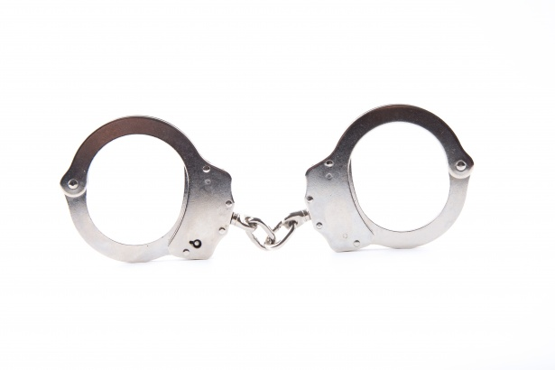
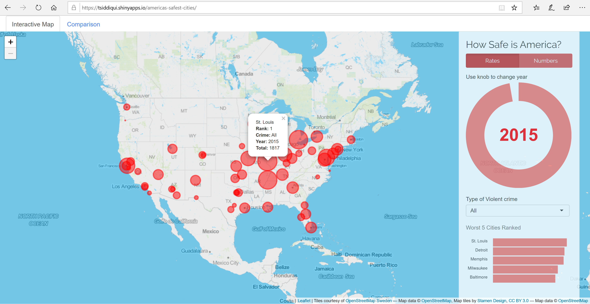
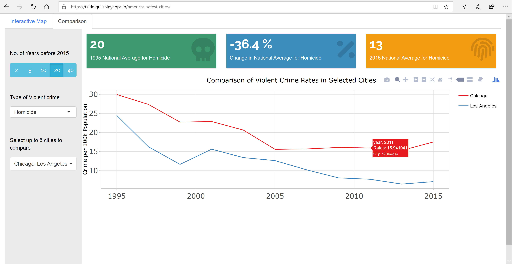

_Academic project by Talha Siddiqui as part of Master of Data Science at University of British Columbia._

# [How Safe is America?](https://tsiddiqui.shinyapps.io/americas-safest-cities/)
Shiny App to explore and compare exactly how safe is America.

### Explore

Interactive map allows zooming into a desired region of the country to exploring the crime rates and raw figures.

### Compare

Line graph allows easy analysis of crime trends for desired cities.

If you'd like to get in touch, contribute to this project, or make a suggestion for new features, please reach me on [my GitHub](https://github.com/talhaadnan100/). Thanks!
